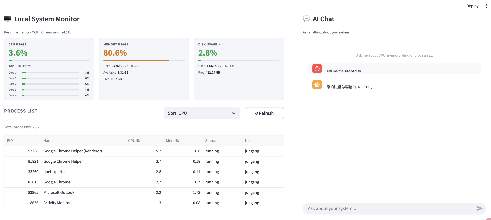

# Local System Monitor — MCP + AI Chat

A local system resource monitoring tool built on the MCP (Model Context Protocol), combined with a locally running Ollama LLM. Query CPU, memory, disk, and process information through natural language.

---

## Screenshot



The interface is split into two panels:
- **Left** — Three metric cards (CPU, Memory, Disk) with color-coded usage indicators and a sortable process list
- **Right** — AI chat powered by a local Ollama model; ask anything about your system in natural language

---

## Features

- **CPU Usage** — Real-time per-core and overall CPU utilization
- **Memory Usage** — Total, used, available, and usage percentage
- **Disk Usage** — Disk space usage for any specified path
- **Process List** — Top N processes sorted by CPU or memory usage
- **AI Chat** — Natural language queries powered by a local Ollama model

---

## Tech Stack

| Layer | Technology |
|-------|------------|
| MCP Server | Python 3.11+ · `mcp` SDK · `psutil` · `uvicorn` |
| LLM | Ollama · `gemma4:31b` (runs locally) |
| Frontend | Streamlit · `requests` |

---

## Project Structure

```
mcp-sys-usage/
├── mcp-server/
│   ├── server.py              # MCP Server entry point (SSE transport)
│   ├── tools/
│   │   ├── cpu.py             # CPU usage tool
│   │   ├── memory.py          # Memory usage tool
│   │   ├── disk.py            # Disk usage tool
│   │   └── process.py         # Process list tool
│   └── requirements.txt
│
├── frontend/
│   ├── app.py                 # Streamlit main app
│   ├── mcp_client.py          # MCP Server call wrapper
│   ├── ollama_client.py       # Ollama API wrapper
│   └── requirements.txt
│
└── README.md
```

---

## Getting Started

### Prerequisites

- Python 3.11+
- [Ollama](https://ollama.com) installed and running
- Model pulled: `ollama pull gemma4:31b`

### 1. Start the MCP Server

```bash
cd mcp-server
pip install -r requirements.txt
python server.py
# MCP Server runs at http://localhost:8000
```

### 2. Start the Frontend

```bash
cd frontend
pip install -r requirements.txt
streamlit run app.py
# Frontend runs at http://localhost:8501
```

### 3. Make sure Ollama is running

```bash
ollama serve
```

---

## Usage

Open your browser at `http://localhost:8501`. You can:

- Click quick-action buttons to instantly query CPU / Memory / Disk / Process info
- Type natural language questions in the chat box, for example:
  - *"Which process is using the most CPU right now?"*
  - *"How much memory is still available?"*
  - *"What is the disk usage for the root directory?"*

---

## MCP Tools Reference

| Tool Name | Description | Parameters |
|-----------|-------------|------------|
| `get_cpu_usage` | Get CPU utilization | `interval: float = 1.0` (sampling interval in seconds) |
| `get_memory_usage` | Get memory usage | none |
| `get_disk_usage` | Get disk usage | `path: str = "/"` |
| `get_process_list` | Get system process list | `limit: int = 20`, `sort_by: str = "cpu"` |

---

## License

MIT
